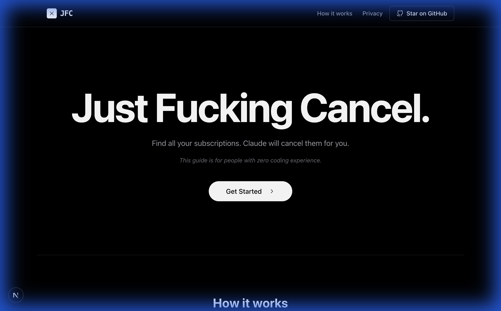

# Just Fucking Cancel

Find all your forgotten subscriptions. Cancel them with AI.



---

## Prerequisites

Before running this project, ensure you have the following installed:

| Tool | Version | Check Command |
|------|---------|---------------|
| **Node.js** | 18.x or higher | `node -v` |
| **npm** | 9.x or higher | `npm -v` |

### Installing Node.js

**Mac (using Homebrew)**:
```bash
brew install node
```

**Windows (using installer)**:
Download from [nodejs.org](https://nodejs.org/) and run the installer.

**Linux (Ubuntu/Debian)**:
```bash
curl -fsSL https://deb.nodesource.com/setup_20.x | sudo -E bash -
sudo apt-get install -y nodejs
```

---

## Getting Started

### 1. Clone the repository

```bash
git clone https://github.com/rohunvora/just-fucking-cancel.git
cd just-fucking-cancel
```

### 2. Install dependencies

```bash
npm install
```

### 3. Run the development server

```bash
npm run dev
```

### 4. Open in browser

Navigate to [http://localhost:3000](http://localhost:3000)

---

## Available Scripts

| Command | Description |
|---------|-------------|
| `npm run dev` | Start development server with hot reload |
| `npm run build` | Create production build |
| `npm run start` | Start production server |
| `npm run lint` | Run ESLint |

---

## Tech Stack

- **Framework**: [Next.js 15](https://nextjs.org/) (App Router)
- **Styling**: [Tailwind CSS v4](https://tailwindcss.com/)
- **Icons**: [Hugeicons](https://hugeicons.com/)
- **Animation**: [Framer Motion](https://www.framer.com/motion/)
- **Language**: TypeScript (Strict Mode)

---

## Project Structure

```
├── app/                  # Next.js App Router
│   ├── layout.tsx        # Root layout with metadata
│   ├── page.tsx          # Home page
│   ├── globals.css       # Global styles
│   ├── sitemap.ts        # Dynamic sitemap
│   ├── robots.ts         # Robots.txt config
│   └── manifest.ts       # PWA manifest
├── components/
│   ├── landing-page.tsx  # Main landing page component
│   └── ui/               # Reusable UI components
├── lib/
│   └── utils.ts          # Utility functions
├── public/               # Static assets
└── legacy/               # Original static site (reference only)
```

---

## Deployment

This project is configured for **Vercel** deployment.

1. Push to GitHub
2. Import in [Vercel Dashboard](https://vercel.com/new)
3. Vercel auto-detects Next.js and deploys

The `vercel.json` and `.vercelignore` ensure the Next.js app is deployed (not the legacy folder).

---

## SEO & Performance

- ✅ Sitemap at `/sitemap.xml`
- ✅ Robots.txt at `/robots.txt`
- ✅ PWA manifest
- ✅ OpenGraph & Twitter cards
- ✅ Optimized fonts with `next/font`
- ✅ Static generation for all routes

---

## License

MIT
